# Manual de uso - Dalfi Studio Nail & Academy ERP

Fecha de elaboración: 2026-07-02  
Aplicación: NailUnit ERP / ERP Centro de Uñas  
URL local de trabajo: http://127.0.0.1:8765/index.html

## Índice

1. Dashboard
2. Facturación
3. Cuentas por cobrar
4. Transferencias pendientes
5. Reservas
6. Nómina
7. Cierres de caja
8. Conciliación de tarjetas
9. Egresos
10. Inventario
11. Activos fijos
12. Reportes
13. Base de datos
14. Guiones sugeridos para videos

---

## 1. Dashboard

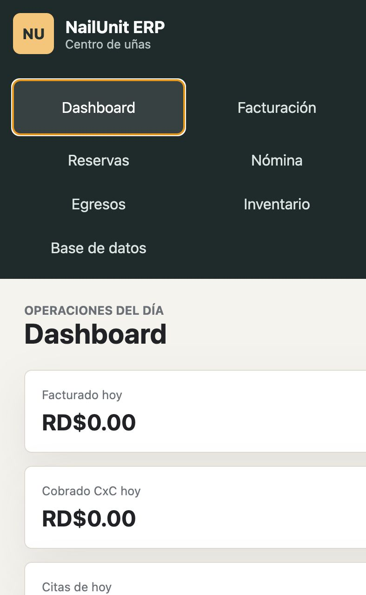

### Objetivo

El Dashboard muestra una vista rápida de la operación del día: facturación, cobros de cuentas por cobrar, citas del día y caja estimada.

### Cómo usarlo

1. Entrar al menú **Dashboard**.
2. Revisar las tarjetas superiores:
   - **Facturado hoy**.
   - **Cobrado CxC hoy**.
   - **Citas de hoy**.
   - **Caja estimada**.
3. Revisar las tablas de facturación del día, CxC cobradas y citas.

### Uso recomendado

Usarlo al inicio, durante y al cierre del día para monitorear la operación sin entrar a cada módulo.

---

## 2. Facturación

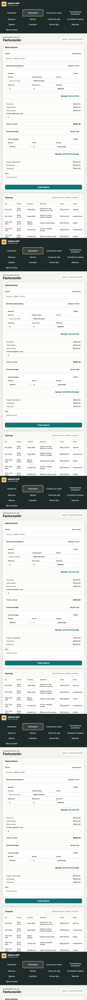

### Objetivo

Registrar facturas de servicios, asociando cliente, servicios, colaboradoras, propinas, descuentos, adicionales y formas de pago.

### Flujo básico

1. Entrar a **Facturación**.
2. Buscar el cliente en el campo **Cliente**.
3. Si el cliente no existe, usar **Crear cliente** y completar sus datos.
4. Agregar uno o varios servicios en **Servicios de la factura**.
5. Para cada servicio:
   - Seleccionar servicio.
   - Seleccionar colaboradora.
   - Confirmar o modificar precio.
   - Agregar adicional y detalle si aplica.
   - Agregar descuento y detalle si aplica.
6. Agregar propina si aplica.
7. Revisar la distribución de propina por colaboradora.
8. Agregar una o varias formas de pago.
9. Revisar total, pendiente y sobrante.
10. Presionar **Crear factura**.

### Formas de pago disponibles

- Efectivo.
- Tarjeta.
- Transferencia confirmada.
- Transferencia pendiente.
- Crédito.
- Balance a favor.

### Validaciones importantes

- La factura no debe quedar descuadrada.
- Si el pago es menor al total, debe registrarse crédito o transferencia pendiente.
- Si el pago excede el total, el sobrante puede ir a sobrante de caja o balance a favor.
- Si se usa tarjeta, debe seleccionarse la compañía adquiriente configurada.

---

## 3. Cuentas por cobrar

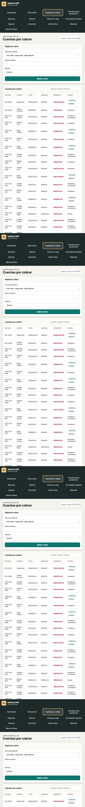

### Objetivo

Controlar facturas pendientes, créditos de clientes, transferencias pendientes y cuentas por cobrar asociadas a adquirentes.

### Flujo para cobrar una cuenta

1. Entrar a **Cuentas por cobrar**.
2. Seleccionar la factura pendiente.
3. Indicar monto cobrado.
4. Seleccionar método de cobro.
5. Presionar **Aplicar cobro**.

### Acciones disponibles

- Confirmar transferencia pendiente.
- Declinar transferencia pendiente.
- Ver pendiente, abonado y total.

### Validaciones importantes

- Las transferencias pendientes no cuentan como ingreso confirmado hasta confirmarse.
- Si una transferencia se declina, queda como deuda vencida inmediata del cliente.

---

## 4. Transferencias pendientes

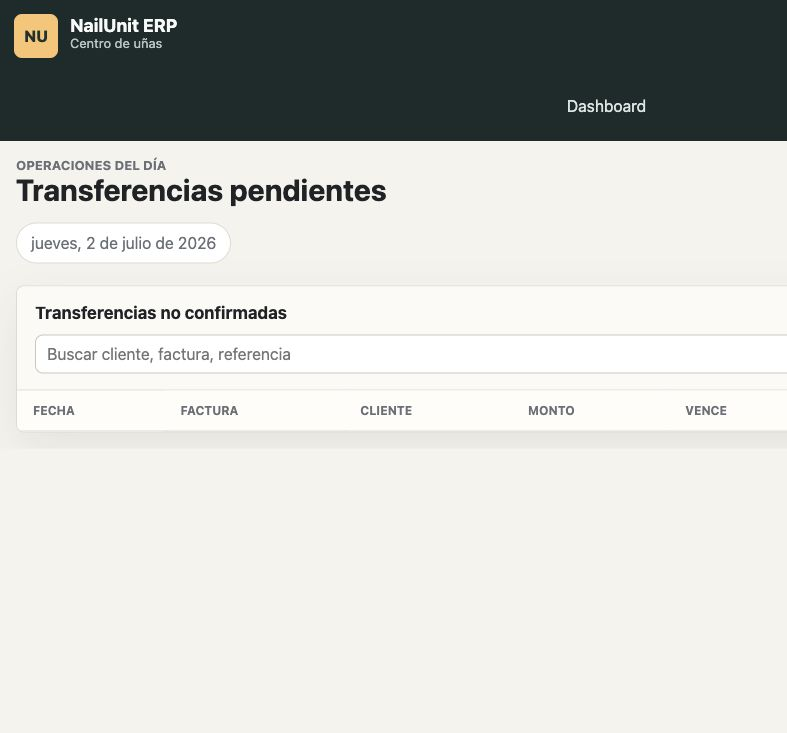

### Objetivo

Gestionar por separado las transferencias no confirmadas.

### Cómo usarlo

1. Entrar a **Transferencias pendientes**.
2. Buscar por cliente, factura o referencia.
3. Revisar monto, vencimiento y cliente.
4. Presionar:
   - **Confirmar** si el dinero entró realmente.
   - **Declinar** si la transferencia no se completó.

### Resultado de cada acción

- Confirmar: registra ingreso y salda la cuenta pendiente.
- Declinar: convierte el pendiente en cuenta por cobrar vencida del cliente.

---

## 5. Reservas

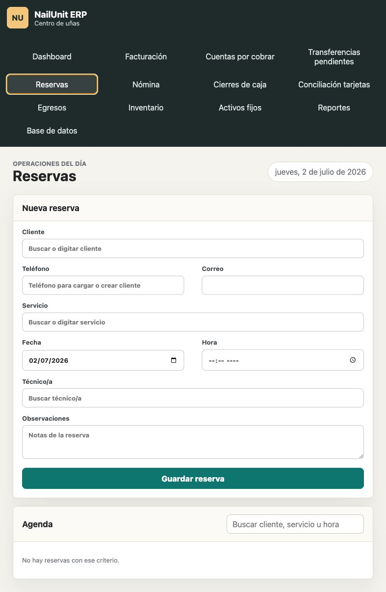

### Objetivo

Registrar citas por cliente, servicio, fecha, hora y colaboradora.

### Flujo de reserva

1. Entrar a **Reservas**.
2. Buscar o digitar cliente.
3. Si se coloca teléfono y el cliente existe, se cargan sus datos.
4. Seleccionar servicio.
5. Seleccionar fecha y hora.
6. Seleccionar técnico/a.
7. Agregar observaciones.
8. Presionar **Guardar reserva**.

### Facturar desde reserva

1. En la lista de agenda, presionar **Facturar**.
2. El sistema abre Facturación.
3. Trae cliente, servicio y colaboradora desde la reserva.
4. Se pueden modificar servicios antes de crear la factura.

### Trazabilidad

Cuando una reserva se factura, queda asociada al número de factura generado.

---

## 6. Nómina

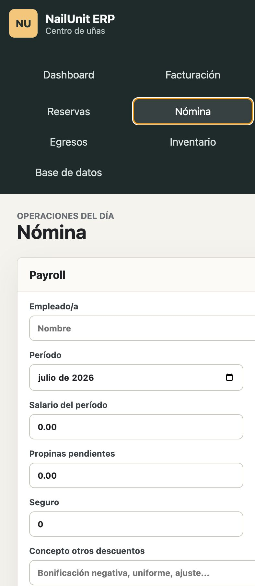

### Objetivo

Generar payroll de colaboradoras tomando salario, comisiones, propinas y descuentos.

### Flujo básico

1. Entrar a **Nómina**.
2. Seleccionar empleado/a.
3. Seleccionar período.
4. Seleccionar corte:
   - Mes completo.
   - Primera quincena.
   - Segunda quincena.
5. Revisar salario del período, comisión y propinas pendientes.
6. Agregar descuentos AFP, seguro u otros.
7. Seleccionar CxC del colaborador a descontar si aplica.
8. Revisar neto a pagar.
9. Presionar **Generar payroll y cuenta por pagar**.

### Validaciones importantes

- Las comisiones dependen de los umbrales asignados a cada colaboradora.
- Las propinas pendientes se marcan como asociadas a nómina al generar payroll.
- El payroll genera una cuenta por pagar.

---

## 7. Cierres de caja

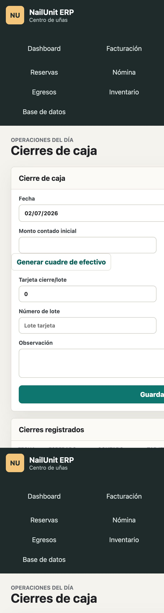

### Objetivo

Registrar el cierre de caja comparando efectivo esperado contra efectivo contado.

### Flujo básico

1. Entrar a **Cierres de caja**.
2. Seleccionar fecha.
3. Digitar monto contado inicial.
4. Registrar gastos del día si aplica.
5. Presionar **Generar cuadre de efectivo**.
6. Revisar efectivo esperado, diferencia, faltante o sobrante.
7. Si hay faltante:
   - Documentar motivo.
   - Registrar monto contado rectificado.
8. Registrar tarjeta cierre/lote, compañía tarjeta, número de lote y transferencias confirmadas.
9. Presionar **Guardar cierre**.

### Validaciones importantes

- El efectivo esperado se muestra solo al generar cuadre.
- Si hay faltante, se exige motivo y monto rectificado.
- Si hay sobrante, se registra como sobrante de caja.

---

## 8. Conciliación de tarjetas

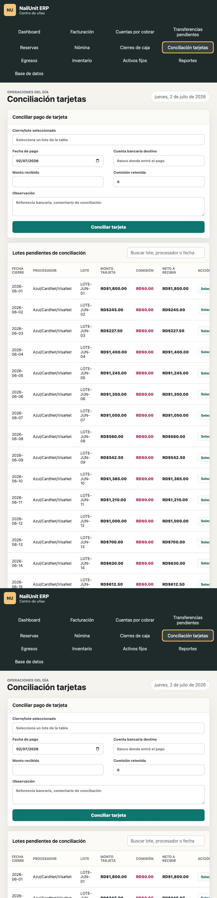

### Objetivo

Conciliar pagos realizados con tarjeta contra depósitos reales recibidos del adquirente.

### Flujo básico

1. Entrar a **Conciliación tarjetas**.
2. Seleccionar un lote pendiente.
3. Indicar fecha de pago.
4. Seleccionar cuenta bancaria destino.
5. Revisar monto recibido y comisión retenida.
6. Agregar observación si aplica.
7. Presionar **Conciliar tarjeta**.

### Resultado

- Registra ingreso bancario.
- Salda o reduce la CxC del adquirente.
- Registra la comisión de tarjeta como cuenta por pagar pagada.

---

## 9. Egresos

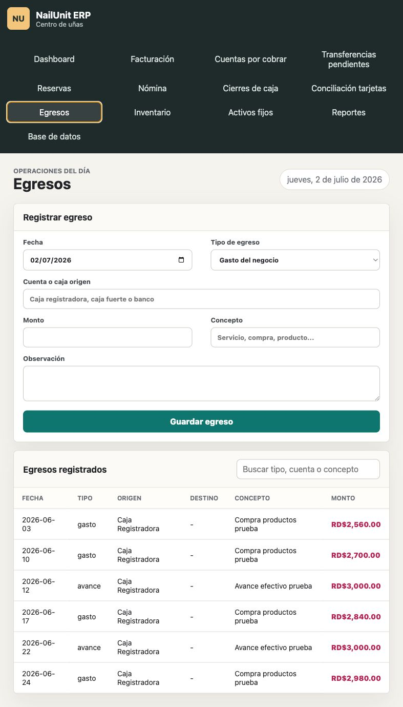

### Objetivo

Registrar salidas de dinero desde cuentas o cajas.

### Tipos de egreso

- Gasto del negocio.
- Costo operativo/activo.
- Inversión al activo.
- Transferencia entre cuentas/cajas.
- Avance autorizado.

### Flujo básico

1. Entrar a **Egresos**.
2. Seleccionar fecha.
3. Seleccionar tipo de egreso.
4. Seleccionar cuenta o caja origen.
5. Revisar disponible en origen.
6. Completar destino si es transferencia.
7. Completar suplidor o colaborador si es avance.
8. Indicar monto y concepto.
9. Presionar **Guardar egreso**.

### Validaciones importantes

- No permite egresar más dinero del disponible.
- Los avances solo se permiten a colaboradores o suplidores.
- Las transferencias internas mueven balance entre cuentas sin ser ingreso operativo.

---

## 10. Inventario

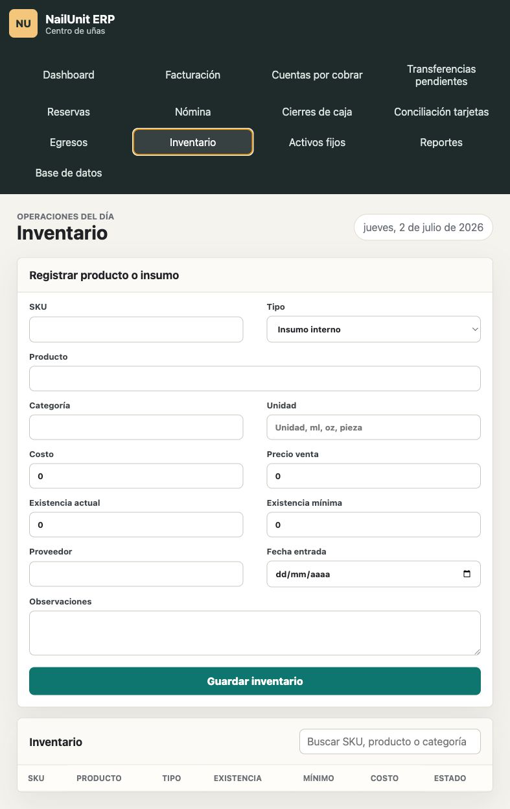

### Objetivo

Registrar productos, insumos, herramientas y artículos de venta.

### Campos principales

- SKU.
- Tipo.
- Producto.
- Categoría.
- Unidad.
- Costo.
- Precio de venta.
- Existencia actual.
- Existencia mínima.
- Proveedor.
- Fecha de entrada.
- Observaciones.

### Flujo básico

1. Entrar a **Inventario**.
2. Completar los datos del producto o insumo.
3. Registrar existencia actual.
4. Presionar **Guardar inventario**.

### Uso recomendado

Este módulo queda preparado para una fase posterior donde se descuente inventario por ventas o por uso en servicios.

---

## 11. Activos fijos

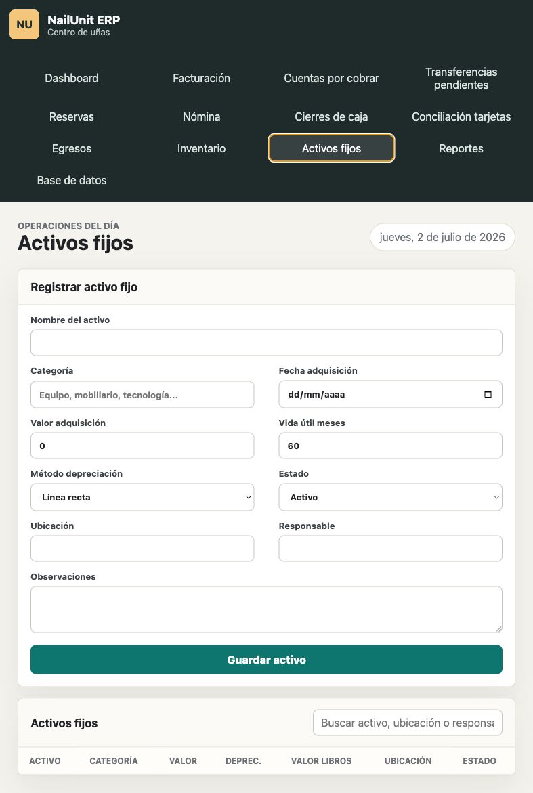

### Objetivo

Registrar equipos, mobiliario y activos de la empresa.

### Campos principales

- Nombre del activo.
- Categoría.
- Fecha de adquisición.
- Valor de adquisición.
- Vida útil en meses.
- Método de depreciación.
- Estado.
- Ubicación.
- Responsable.
- Observaciones.

### Flujo básico

1. Entrar a **Activos fijos**.
2. Completar los datos del activo.
3. Indicar valor y vida útil.
4. Presionar **Guardar activo**.

### Resultado

El sistema calcula depreciación lineal y valor en libros.

---

## 12. Reportes

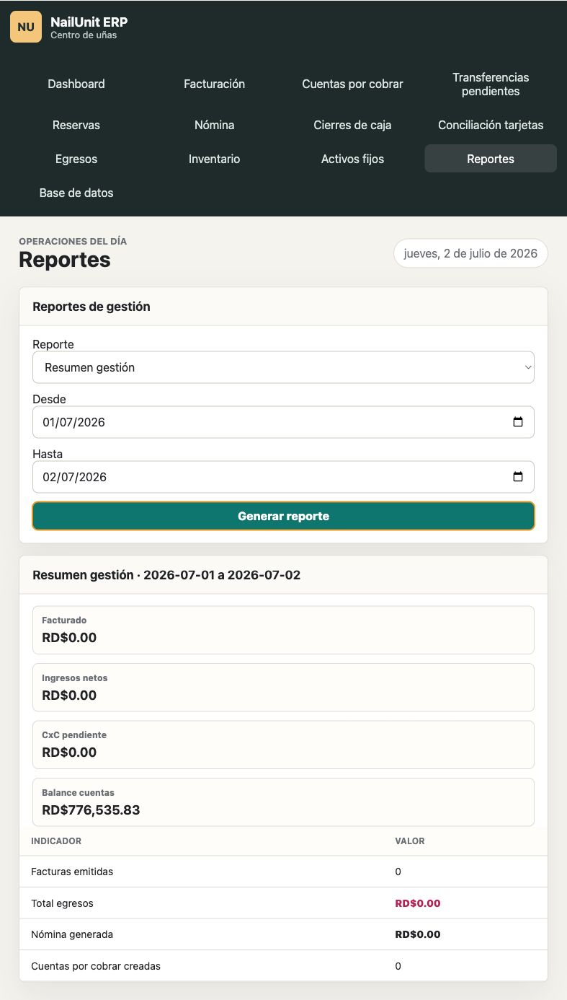

### Objetivo

Generar reportes financieros, operativos y de gestión.

### Flujo básico

1. Entrar a **Reportes**.
2. Seleccionar tipo de reporte.
3. Seleccionar fecha desde y hasta.
4. Completar filtros adicionales si aplican.
5. Presionar **Generar reporte**.

### Reportes disponibles

- Resumen gestión.
- Balance general cuentas.
- Movimientos de cuenta.
- Facturación.
- Cuentas por cobrar.
- Nómina.
- Facturación por colaborador.
- Cierres de caja.
- Ingresos por forma de pago.
- CxC adquirentes tarjeta.
- Transferencias no confirmadas.
- Propinas por colaborador.
- Comisiones por colaborador.
- Egresos por categoría.
- Servicios más vendidos.
- Clientes frecuentes.
- Inventario.
- Activos fijos.

---

## 13. Base de datos

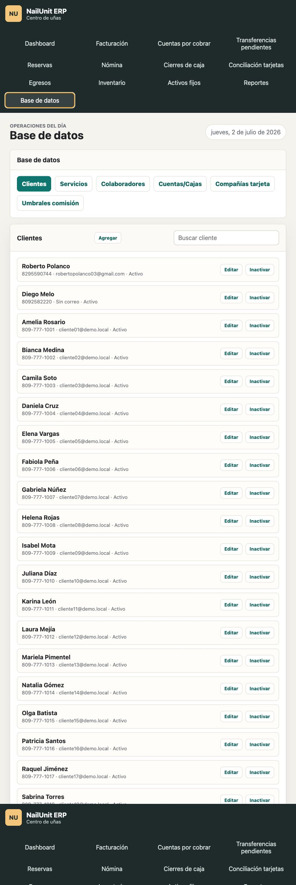

### Objetivo

Administrar los catálogos principales del ERP.

### Catálogos disponibles

- Clientes.
- Servicios.
- Colaboradores.
- Cuentas/Cajas.
- Compañías tarjeta.
- Umbrales comisión.

### Flujo básico

1. Entrar a **Base de datos**.
2. Seleccionar el catálogo.
3. Usar **Agregar** para crear un nuevo registro.
4. Usar **Editar** para modificar.
5. Usar **Inactivar** para dejar de usar sin borrar historial.

### Validaciones importantes

- No se recomienda eliminar registros con historial financiero.
- Usar inactivación para conservar trazabilidad.

---

## 14. Guiones sugeridos para videos

### Video 1 - Facturación completa

1. Abrir Facturación.
2. Crear cliente.
3. Agregar dos servicios con colaboradoras diferentes.
4. Agregar adicional, descuento y propina.
5. Dividir la propina.
6. Agregar pago mixto.
7. Crear factura.
8. Mostrar la factura en la tabla.

### Video 2 - Transferencia pendiente

1. Crear factura con transferencia pendiente.
2. Ir a Transferencias pendientes.
3. Mostrar confirmar.
4. Repetir ejemplo declinando y ver CxC vencida.

### Video 3 - Tarjeta y conciliación

1. Crear factura con tarjeta.
2. Registrar cierre con lote.
3. Entrar a Conciliación tarjetas.
4. Seleccionar lote.
5. Conciliar contra banco.

### Video 4 - Crédito y cobro posterior

1. Crear factura a crédito.
2. Entrar a Cuentas por cobrar.
3. Registrar cobro parcial.
4. Mostrar saldo pendiente.

### Video 5 - Nómina

1. Entrar a Base de datos y revisar colaboradora/umbrales.
2. Entrar a Nómina.
3. Seleccionar período y corte.
4. Revisar comisión, propina y descuentos.
5. Generar payroll.

### Video 6 - Cierre de caja

1. Entrar a Cierres de caja.
2. Colocar monto contado.
3. Generar cuadre.
4. Documentar faltante si aplica.
5. Guardar cierre.

### Video 7 - Reportes

1. Entrar a Reportes.
2. Seleccionar Balance general cuentas.
3. Seleccionar rango.
4. Generar reporte.
5. Repetir con facturación por colaborador y CxC.

